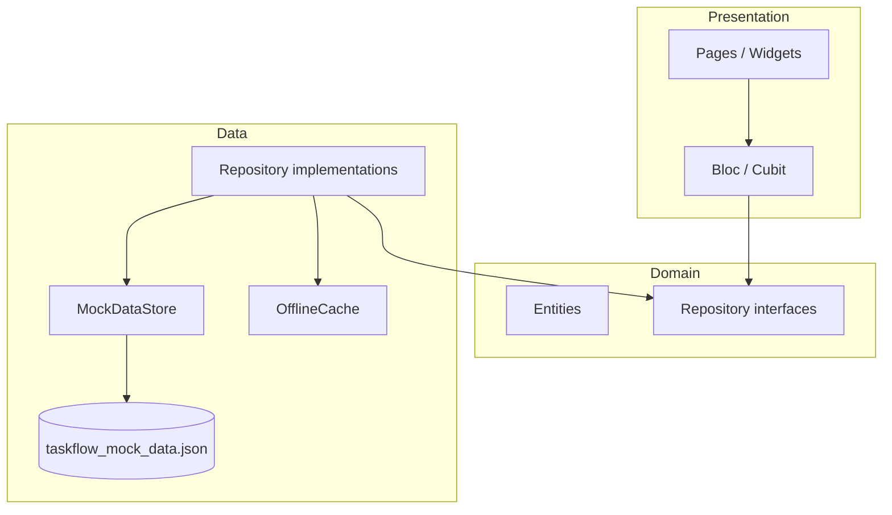

# TaskFlow Architecture

## Overview

TaskFlow follows a **feature-first clean architecture**. Each feature owns presentation, domain, and data layers. The UI never reads JSON directly; it talks to Cubits/Bloc, which call repository interfaces.



## State management

| Area | Approach |
|------|----------|
| Authentication | `AuthBloc` — splash restore, login, logout |
| Features | `Cubit` per screen (projects, tasks, home, profile, notifications) |
| App settings | `AppSettingsCubit` — offline + error simulation toggles |

List screens use a consistent state shape:

```
Initial → Loading → Success | Empty | Failure
```

Mutations may emit `ActionFailure` with the previous success state preserved.

## Data layer

### MockDataStore

Central in-memory store loaded once from the bundled JSON asset. Holds organizations, users, projects, tasks, comments, notifications, and auth mock credentials.

`simulateRequest({isWrite})` adds delay and enforces:

- **Simulate network error** → throws `NetworkException`
- **Offline + write** → throws `OfflineException`
- **Offline + read** → allowed (serves memory/cache)

### OfflineCache

Persists org-scoped project and task snapshots to SharedPreferences after successful online reads/writes. When offline, repositories restore cached data into `MockDataStore` before returning results.

Keys: `tf_cached_projects_{orgId}`, `tf_cached_tasks_{orgId}`, `tf_last_sync_at`.

### Repositories

Interfaces live in `domain/repositories/`. Implementations map JSON models → domain entities and enforce business rules (org scoping, admin delete, assignee validation).

Swapping to a real API later: keep interfaces + Cubits; replace implementations with HTTP clients.

## Simulated authentication

1. Login validates email/password against `auth_mock.test_credentials` in JSON
2. On success, access + refresh tokens and session metadata are stored in **Secure Storage**
3. Access token expires after **900 seconds** (15 minutes)
4. On cold start, `restoreSession()` refreshes if access expired but refresh is valid
5. Logout clears secure storage
6. Passwords are never stored locally

## Navigation

`go_router` with an auth redirect guard:

- Unauthenticated → login/register/splash
- Authenticated → shell with Home, Projects, Tasks, Notifications, Profile

## Error handling

| Type | When |
|------|------|
| `ValidationException` | Form / business validation |
| `NotFoundException` | Missing entity (incl. `task_force_404`) |
| `ForbiddenException` | Non-admin delete |
| `OfflineException` | Writes while offline |
| `NetworkException` | Simulated network failure |
| `TimeoutException` | `proj_force_timeout` project load |
| `AuthException` | Invalid credentials / expired refresh |

UI maps these to snackbars, error states with retry, or the offline banner.

## Local storage summary

| Storage | Purpose |
|---------|---------|
| Secure Storage | JWT-style session tokens + user/org metadata |
| SharedPreferences | Offline/error toggles, cached projects/tasks, last sync |

## Key decisions

1. **Bloc over Riverpod** — explicit event/state flow for auth; Cubits for simpler feature screens
2. **Single MockDataStore singleton** — simpler than separate datasource classes for a mock-only assignment; repositories still isolate UI from storage details
3. **Client-side task filtering in TaskCubit** — fast UX for search + filters on already-loaded list; repository `TaskFilter` supports due-date range for consistency
4. **No Firebase / no live API** — per assignment rules

## Testing

- **Unit:** validators, auth session, repositories, TaskCubit filters
- **Widget:** shared state widgets, AppTextField validation
- **Integration:** login + projects tab (device/emulator)

Tests use fake repositories or `createTestEnvironment()` with mocked SharedPreferences — no real network.
